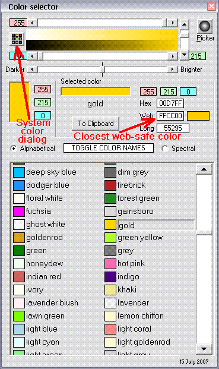



## Color Selector\(Final 15 July\)

### Description

Color Selector by Robert Rayment. Select a color from a list of 140 named colors or from an RGB gradient display. Color info to clipboard. Form location in ini file. Color names from www.learningwebdesign.com/colornames.html. Addition 12 July: Added, by request, spectrally sorted colors (empirical).... Change 13 July: Better Darker/Brighter action.... Additions 15 July: Added system color dialog &amp; closest web-safe colors. Apart from any mistakes this is surely now finished! See Form1 for all updates. Zip 18 KB.
 
### More Info
 
Just run

Color info

             |
---                |---
**Submitted On**   |2007-07-15 12:41:18
**By**             |[Robert Rayment](https://github.com/Planet-Source-Code/PSCIndex/blob/master/ByAuthor/robert-rayment.md)
**Level**          |Beginner
**User Rating**    |4.8 (82 globes from 17 users)
**Compatibility**  |VB 6\.0
**Category**       |[Graphics](https://github.com/Planet-Source-Code/PSCIndex/blob/master/ByCategory/graphics__1-46.md)
**World**          |[Visual Basic](https://github.com/Planet-Source-Code/PSCIndex/blob/master/ByWorld/visual-basic.md)
**Archive File**   |[Color\_Sele2075547152007\.zip](https://github.com/Planet-Source-Code/robert-rayment-color-selector-final-15-july__1-68957/archive/master.zip)

### API Declarations

A couple - see code

